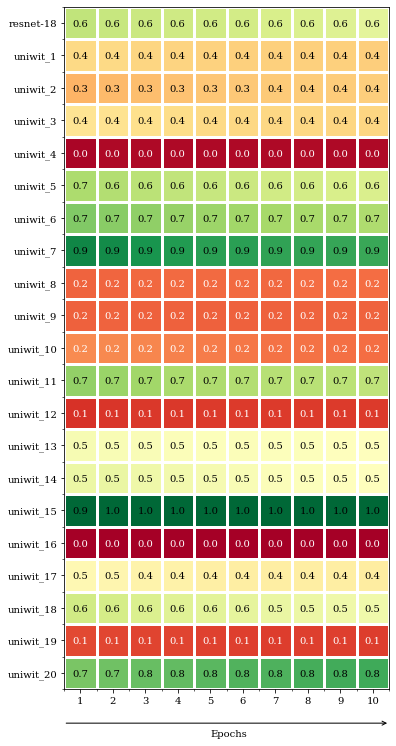
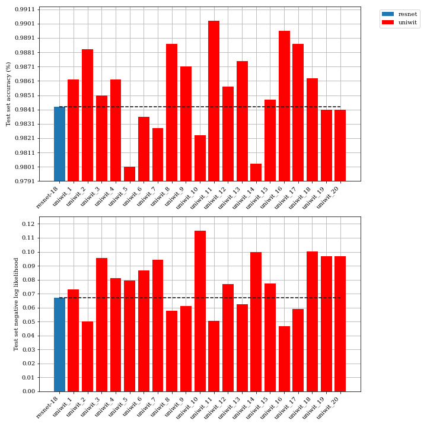

# Automatic Generation of Neural Architecture Search Spaces

This repository contains code for generating neural architectures that have defined input and output dimensions, such is particularly useful if one already has a lower K-Dimension and wants to map a representation in K-Dimension to it. This happens in neural networks with multiple data views where the "output" dimension is the encoded shared dimension. This work is done with the motivation of removing the human bias from the search space that Neural Architecture Search (NAS) algorithms operate on.

## Setup

```
git clone https://github.com/DCalhas/auto-nas-space.git

cd rob_project

conda create -n ENV_NAME python=3.8
conda activate ENV_NAME
pip install -r requirements.txt
```

## Run

To run code simply run the following command with mode={all, limited, limited_uniform}:

```
python3.8 main.py mode [-n LOWER_BOUND_NUMBER_LAYERS] [-N UPPER_BOUND_NUMBER_LAYERS] [-I INPUT_SHAPE] [-O OUTPUT_SHAPE] [-K NUMBER_INSTANCES] [-uniwit_k k_CONSTANT_UNIWIT] [-verbose VERBOSE]
```

## Evaluating on MNIST

The following commands were the ones used to gather results for the Limited_Uniform-20 approach on the MNIST dataset.

```
cd src
python main.py mode -n 3 -N 3 -I 7,7 -O 1,1 -K 20 -save -save_path PATH_NETWORKS
cd ../evaluate
python na_evaluate.py uni_wit resnet mnist -networks 20 -na_path PATH_NETWORKS -batch_size 1024 -batch_size 0.0001 -epochs 10 -n_classes 10 -seed 42
```

The results present in the paper are the following:

<p float="left">
  
   
</p>
